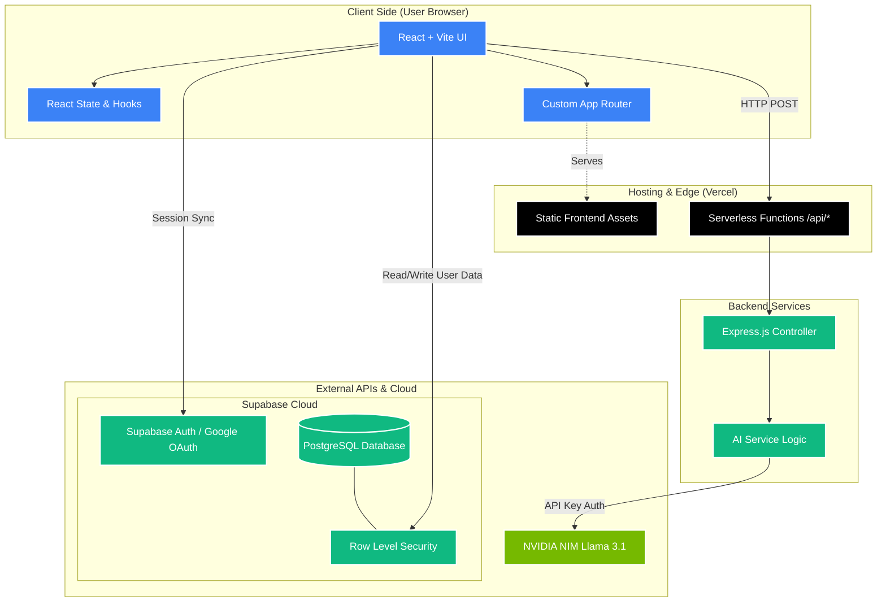

# EduRank | Premium College Discovery Platform 🎓

EduRank is a modern, premium web application designed to help students discover, compare, and predict their chances of admission into top colleges. It features a sleek glassmorphism UI, real-time database syncing, secure authentication, and an integrated NVIDIA AI Chat Assistant.

## 🏗️ System Architecture

Below is the high-level architecture diagram detailing the data flow between the client, Vercel Edge network, serverless backend, and Supabase cloud.



## 🚀 Tech Stack
*   **Frontend**: React.js 18, Vite, TailwindCSS, Lucide React (Icons)
*   **Backend**: Node.js, Express.js (deployed as Vercel Serverless Functions)
*   **Database & Auth**: Supabase (PostgreSQL, Row Level Security, Google OAuth)
*   **AI Integration**: NVIDIA NIM API (Llama-3.1-70B-Instruct model)
*   **Hosting**: Vercel

## ✨ Key Features
1.  **AI Assistant**: A custom-trained AI chatbot that understands the platform's local college data and helps students make decisions.
2.  **Authentication**: Secure Email/Password and Google OAuth sign-in with automatic profile creation via SQL Triggers.
3.  **Real-time Profiles**: Users can edit and save their academic details and track their application status.
4.  **College Comparison**: Users can save up to 3 colleges side-by-side to compare fees, placements, and ratings.
5.  **Predictor**: Evaluates a student's rank against historical cutoffs to predict admission probabilities.

## 🛠️ Local Development Setup

1. **Clone the repository:**
   ```bash
   git clone https://github.com/preetham-18-developer/College-Platform.git
   cd College-Platform
   ```

2. **Install dependencies:**
   ```bash
   npm install
   ```

3. **Set up Environment Variables:**
   Create a `.env` file in the root directory and add the following keys:
   ```env
   VITE_SUPABASE_URL=your_supabase_project_url
   VITE_SUPABASE_ANON_KEY=your_supabase_anon_key
   VITE_AI_API_KEY=your_nvidia_api_key
   ```

4. **Run the development server:**
   ```bash
   npm run dev
   ```
   *(This uses `concurrently` to run the Vite frontend on port 5173 and the Express backend on port 5000 simultaneously).*
